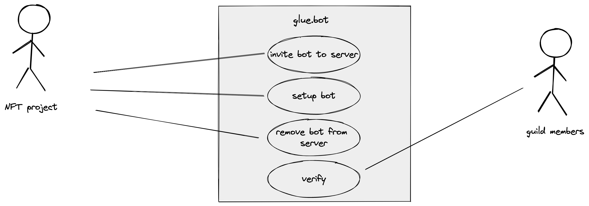

# requirement analysis

## use case diagram

## invite bot to server

Owners of a discord server can invite the bot to their server. The bot can be invited to multiple servers. Upon invitation the bot creates two channels on the server, a glue-join channel and a glue-config channel. The glue-config channel is exclusive to the person setting up the bot. The glue-join channel is for anyone who wants to verify their NFT. It contains a message that starts the verification process. The bot also creates a glue-admin role, that can be assigned to members so that they can perform administrative tasks in glue-config channel, which this role grants access to.

## setup bot

Users on the the server that either have the glue-admin role or general admin role can setup the bot. This way they can give a role to people that hold a certain NFT. They will need to specify the NFT standard, the canister principal and the amount of NFTs that need to be held to have access to the role (min,max). The setup can either take place via a website UI after signing in with discord or the glue-admin channel using bot commands.

## remove bot

Administers can remove the bot from the server. This won't delete the channels or roles created by the bot. It will also not take away token holder roles from users.

## verify

Guild members can verify their assets with the bot. The bot will generate a link that will be sent to the user. When visiting the website the user has to login with their discord account. After that the user has to sign a message to prove that he owns a specific principal. The bot will then check if the principal holds NFTs of the NFT canister it is setup for. If this is the case, the "token granted role" will be assigned.

# architectural design

## component diagram
